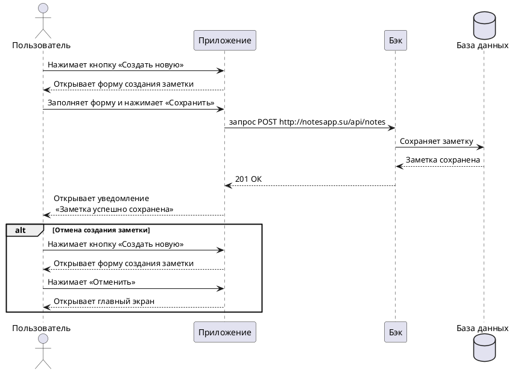

# Инструкция для Нотсапп

## **Пользовательский сценарий «Удаление заметки»**

### Действующие лица:

1. Пользователь

2. Приложение

3. Бэк

4. База данных

### Предварительные условия

Пользователь должен находиться на главном экране.

### Выходные условия

Заметка пользователя удалилась из базы и из списка заметок.

### Основной сценарий

1. Пользователь нажимает на заметку в списке заметок.

2. Приложение открывает заметку.

3. Пользователь нажимает кнопку **Удалить**.

4. Приложение запрашивает подтверждение удаления заметки.

5. Пользователь нажимает кнопку **Да**.

6. Приложение отправляет запрос Бэку на удаление заметки.

7. Бэк удаляет заметку из Базы данных.

8. Бэк возвращает Приложению ответ об успешном удалении заметки.

9. Приложение открывает пользователю уведомление «Заметка успешно удалена!».

### Альтернативный сценарий

1. Пользователь нажимает на заметку в списке заметок.

2. Приложение открывает заметку.

3. Пользователь нажимает кнопку **Удалить**.

4. Приложение запрашивает подтверждение удаления заметки.

5. Пользователь нажимает кнопку **Нет**.

6. Приложение открывает пользователю экран с выбранной заметкой.

7. Пользователь нажимает на кнопку **Мои заметки**.

8. Приложение открывает главный экран со списком заметок.

### Пользовательская диаграмма (шаблон)

