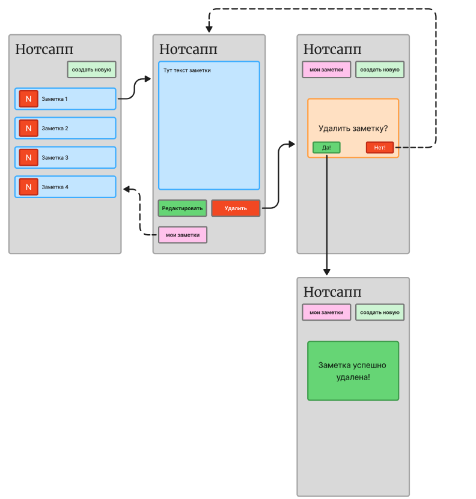
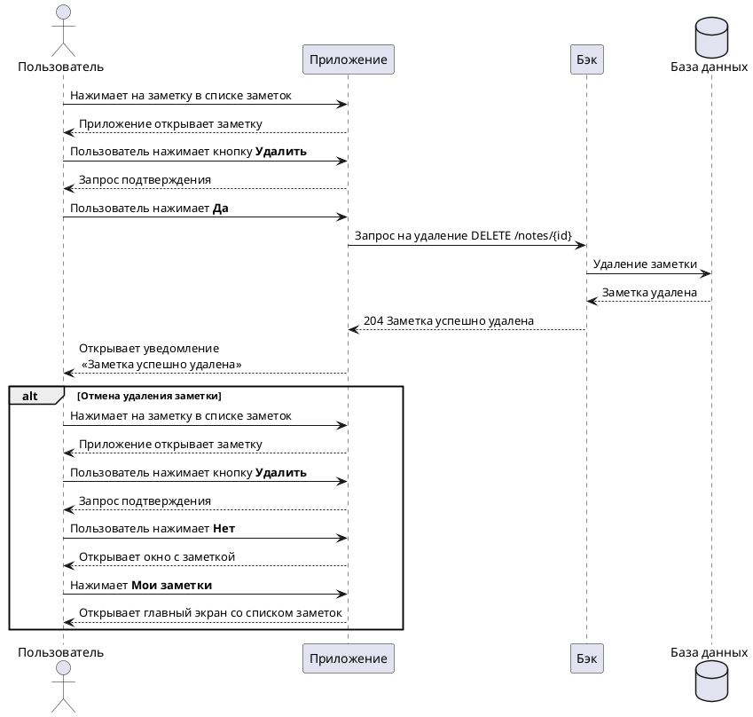

# Инструкция для Нотсапп

## **О продукте**

Нотсапп — это мобильное приложение для пользовательских заметок.

В Нотсаппе можно создавать, хранить и редактировать заметки.

!!! warning "Внимание"
    В рамках мастер-класса был реализован только сценарий для удаления заметки.

# --8<-- [start:delete_note]

## **Пользовательский сценарий «Удаление заметки»**

Пользователь должен иметь возможность удалить выбранную заметку. Система должна удалить данные о заметке и не отображать её в списке заметок.

# --8<-- [end:delete_note]



### Действующие лица:

1. Пользователь

2. Приложение (Frontend Application) — клиентская часть приложения, отвечает за отображение данных и обеспечивает взаимодействие приложения с пользователем.

3. Бэк (Backend) — серверная часть приложения, отвечающая за реализацию функциональности системы.

4. База данных (Database) — база данных для хранения пользовательских заметок.

### Предварительные условия

Пользователь должен находиться на главном экране.

### Выходные условия

Заметка пользователя удалилась из базы и из списка заметок.

### Основной сценарий

1. Пользователь нажимает на заметку в списке заметок.

2. Приложение открывает заметку.

3. Пользователь нажимает кнопку **Удалить**.

4. Приложение запрашивает подтверждение удаления заметки.

5. Пользователь нажимает кнопку **Да**.

6. Приложение отправляет запрос Бэку на удаление заметки.

7. Бэк удаляет заметку из Базы данных.

8. Бэк возвращает Приложению ответ об успешном удалении заметки.

9. Приложение открывает пользователю уведомление «Заметка успешно удалена!».

### Альтернативный сценарий

1. Пользователь нажимает на заметку в списке заметок.

2. Приложение открывает заметку.

3. Пользователь нажимает кнопку **Удалить**.

4. Приложение запрашивает подтверждение удаления заметки.

5. Пользователь нажимает кнопку **Нет**.

6. Приложение открывает пользователю экран с выбранной заметкой.

7. Пользователь нажимает на кнопку **Мои заметки**.

8. Приложение открывает главный экран со списком заметок.

### Диаграмма последовательности


??? note "Код диаграммы"
    ```
    @startuml
    actor Пользователь as user
    participant Приложение as front
    participant Бэк as back
    database "База данных" as bd

    user -> front: Нажимает на заметку в списке заметок
    user <-- front: Приложение открывает заметку
    user -> front: Пользователь нажимает кнопку **"Удалить"**
    user <-- front: Запрос подтверждения
    user -> front: Пользователь нажимает **Да**
    front -> back : Запрос на удаление DELETE /notes/{id}
    back -> bd: Удаление заметки
    bd --> back: Заметка удалена
    front <-- back: 204 Заметка успешно удалена
    user <-- front: Открывает уведомление\n «Заметка успешно удалена»

    alt Отмена удаления заметки
    user -> front: Нажимает на заметку в списке заметок
    user <-- front: Приложение открывает заметку
    user -> front: Пользователь нажимает кнопку **"Удалить"**
    user <-- front: Запрос подтверждения
    user -> front: Пользователь нажимает **Нет**
    user <-- front: Открывает окно c заметк
    user -> front: Нажимает **Мои заметки**
    front --> user: Открывает главный экран со списком заметок
    end alt

    @enduml
    ```